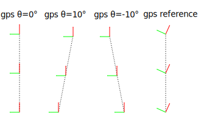

# Nobleo GPS Calibration

This package can be used to calibrate various robot parameters based on sensor data.
The supported parameters are at the moment:
- 2D gps position
- wheel radius
- wheel separation

Each parameter can be included or excluded from the optimization.
At the moment only an offline mode is implemented, the package is designed to support online optimization in the future.

## Usage

```sh
rosrun nobleo_gps_calibration offline bagfile.bag
...
[ INFO] [...]: Final parameters: x=0.000000 y=0.000000 theta=0.014767 separation=1.000000 radius=1.000000
```
There are several parameter that can control the optimization process.
See `cfg/Calibrator.cfg` for more info.

## How it works

Let's look at two data streams from the robot, the odometry and gps data.


From these two data stream you can see that the gps was probably mounted at an angle to the driving direction of the robot.
This package aims to calculate this parameter from sensor data.

What we could do is simulate what a gps receiver would measure based on the odometry data.
For example we could vary the mounting angle.
The figure below shows the simulated gps measurements based on hypothetical gps angles.



The next step is to make a cost function of the error.
Let's take two gps measurements at t<sub>n</sub> and t<sub>n+1</sub>.
Find the corresponding odom measurements.
Align the starting poses.
The error is the difference between the end poses.
There can be an error in x, y and theta.


If we sum these errors for a dataset, we have a problem that can be solved by most non-linear least squares solvers.
Find the minimum of a cost function by varying various parameters.


The Ceres Solver is one such package: http://ceres-solver.org/
This package implementes the idea outlined above.
